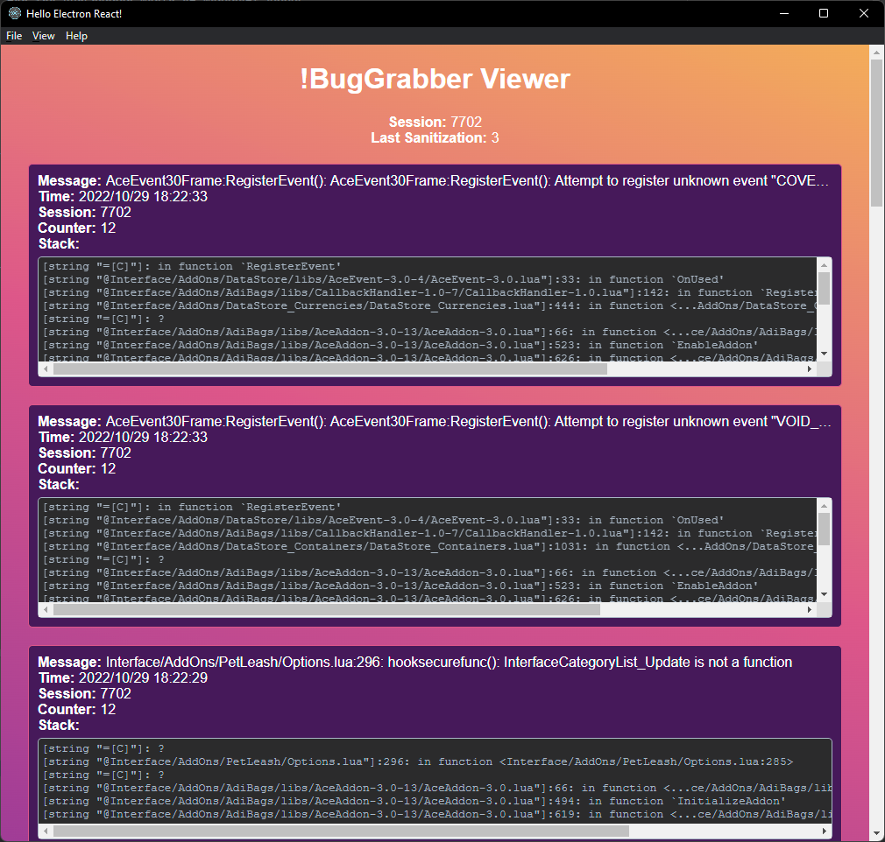

# !BugGrabber Viewer

An Electron app viewer for the [BugGrabber](https://www.curseforge.com/wow/addons/bug-grabber) World of Warcraft addon



Finds a `!BugGrabber.lua` file in `C:/Program Files (x86)/World of Warcraft/_retail_/WTF/Account` and watches for file changes. Whenever the file is updated (`/reload` in game to force save), the UI will update to show the most recently captured bugs.

## Install

Clone the repo and install dependencies:

```bash
npm install
```

**Having issues installing? See our [debugging guide](https://github.com/electron-react-boilerplate/electron-react-boilerplate/issues/400)**

## Starting Development

Start the app in the `dev` environment:

```bash
npm start
```

## Packaging for Production

To package apps for the local platform:

```bash
npm run package
```

## License

MIT © [Electron React Boilerplate](https://github.com/electron-react-boilerplate)
